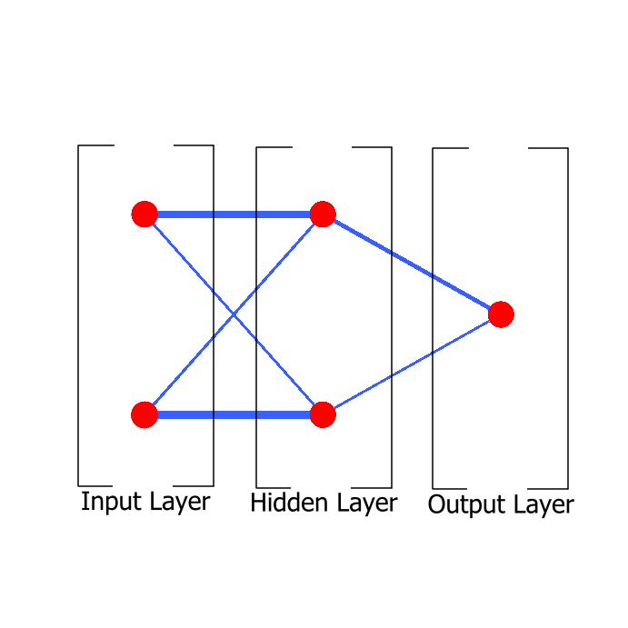

# Flappy Bird Neural

Neural Networks are really interesting and I always wanted to create my own. So I chose a simple game to test. Flappy Bird is a famous mobile game and it's a perfect test subject.
## Features

- Control over how many individuals exists in the game
- Random individuals to avoid [local minimum](https://en.wikipedia.org/wiki/Maxima_and_minima)
- Interface shows with neurons are active at the moment
- Chart to show the progress of generations

## Lessons Learned

I learned Neural networks can use a lot of processing power. I needed to optimize the best I could, so I removed many “foreachs” and unified them into just one. Also, I limited how many times per second some things activate, for example, the network only activates every half second.  

Complexity is not the solution, the simplest the network is, the easiest to train.  

Distances are better than position because if it works in one point, it works for every point with the same distance.

## How does it works?

A neural network is a complex function. It receives information in the first layer also known as the input layer, processes in the hidden layers, and results in the output layer, which is used to control the bird.  

Layer: Each layer has an X amount of neurons, they are linked in order.  

Input Layer: This layer receives the x and y distance from the passage between the pipes.  
Hidden Layer: Neurons in this layer receive information from all neurons in the last layer, all the info is summed and stored in the neuron.  

Output Layer: Works like a hidden layer, but it won't pass information forward, instead its information is used to control the bird  

Neurons: They hold information and decide if they pass it forward, I used a ReLU function, which means that if the neuron input is greater than 0, the information flows.   

Links: For example, all neurons of the first layer are linked with all neurons of the second layer, and each link has a weight and a bias, when the information is passed from one layer to another, it's multiplied by a weight and added by bias.  

## Tests

You can watch this project working here.

## Tech Stack

**Language:** C#

**Engine:** Unity

